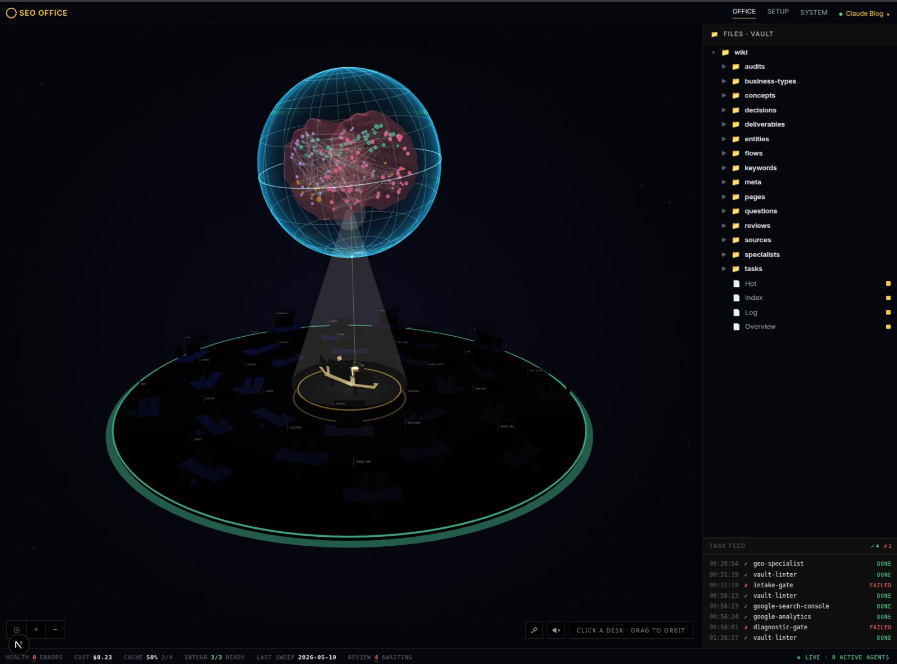
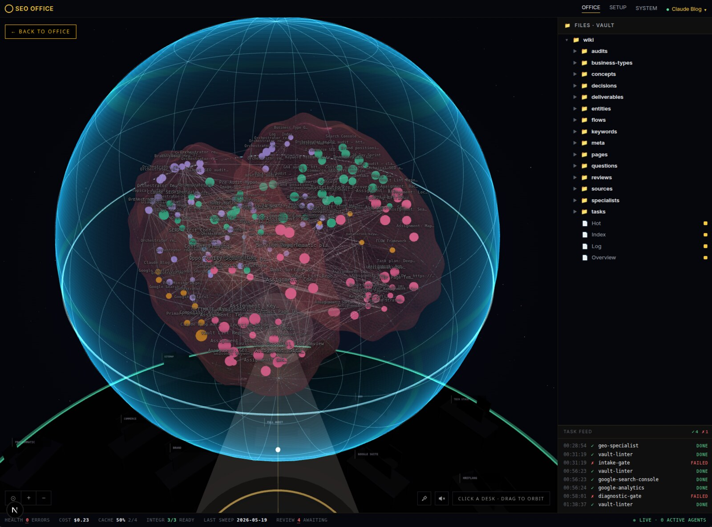
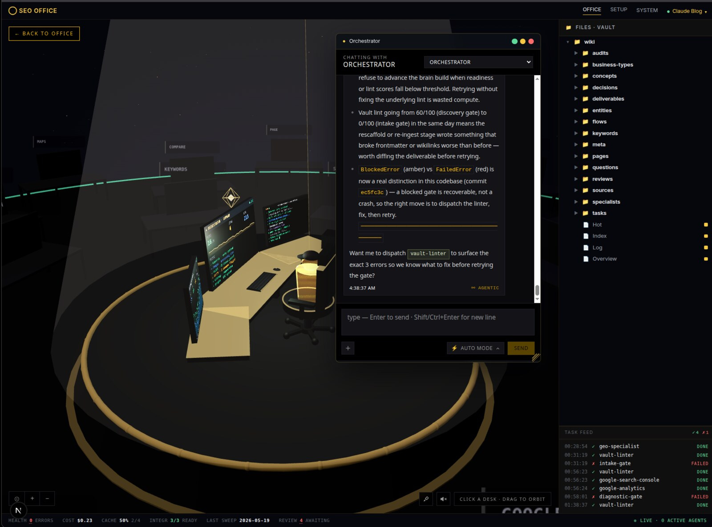
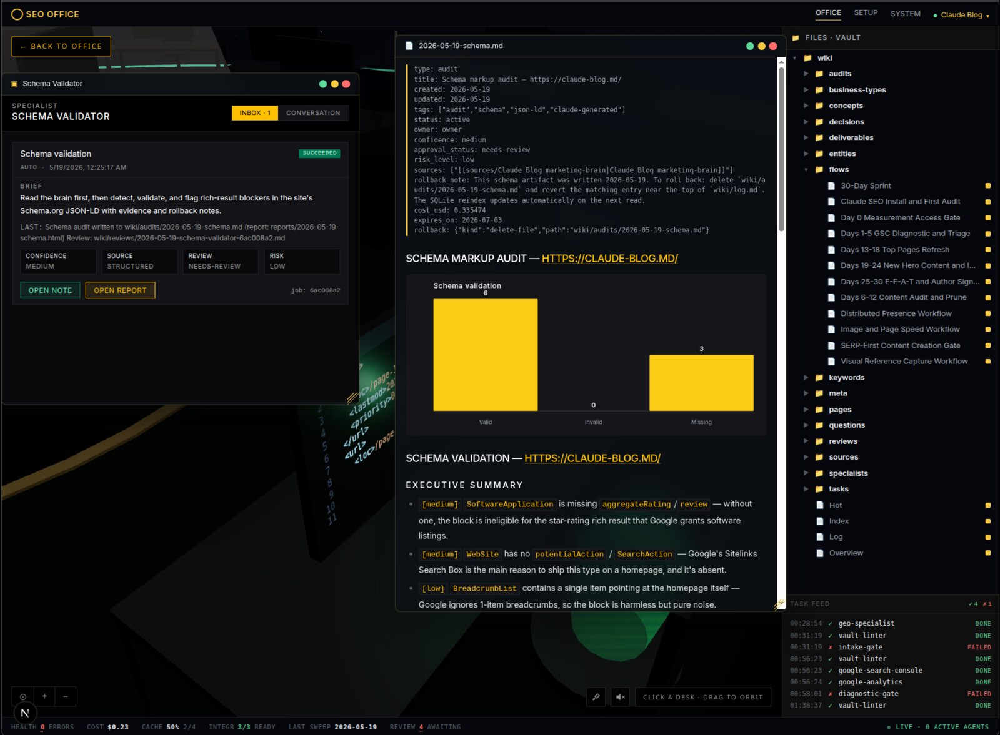

# SEO Office

**A local-first SEO agency operating system.** Walk into a 3D office, click a desk, get work done. Twenty-five AI specialists run audits, research keywords, validate schema, plan content briefs, and tell you what to do next. Everything they learn lands in a per-client second brain on your disk. No cloud, no SaaS, no subscription.

[](https://github.com/AgriciDaniel/seo-os/releases/tag/v0.1.0)
[](LICENSE)
[](src/lib)
[](package.json)
[](package.json)
[](https://www.skool.com/ai-marketing-hub-pro)

> **Open source under [AGPL-3.0](LICENSE).** Clone it, run it, fork it, build on it — the only ask is that network-served modifications stay open (that's the AGPL). Want the guided setup, weekly office hours, and a room full of operators using it on real client work? That happens in the [AI Marketing Hub Pro](https://www.skool.com/ai-marketing-hub-pro) community.

### Why SEO Office

- **Local-first by design.** Every brain note, every audit, every keyword export lives in `./.seo-office/` on your disk. The app talks to LLM providers and SEO APIs through your own keys. We never see your data because we do not run a server.
- **Parallel by default.** The orchestrator dispatches up to 25 specialists into the same sweep. A full "build the brain" run completes in minutes, not the days a manual audit chain takes.
- **Three failure modes, three colors.** The Task Feed reads `RUNNING / REVIEW / DONE / SKIPPED / BLOCKED / FAILED` at a glance. Soft refusals (Search Console property not verified) read yellow. Upstream gate failures (vault lint errors block downstream phases) read amber. Real crashes stay red. You never have to ask "is the system broken or is this expected?"

> Looking for just the SEO analysis skill, without the office shell? Use [`claude-seo`](https://github.com/AgriciDaniel/claude-seo). SEO Office vendors the same specialists; the difference is the orchestration layer, the brain, and the 3D operating-system UI on top.

## What it looks like

The OS shell, the brain, the orchestrator chat, and a specialist desk in mid-audit:



The **brain** is a per-client second brain. Every artifact a specialist writes, every claim it makes, every reviewed note, becomes a node in this graph. Click any node to open the underlying markdown in an OS window. The colored clusters are the eight content domains (audits, keywords, decisions, deliverables, entities, reviews, sources, specialists).



The **orchestrator** is the agency's project manager. Click the spotlit dais at the center of the room to open its chat window. Ask it to "build the brain", "run technical audit", "plan next week's content", "review what's pending." It reads the current state, dispatches the right specialists, and narrates progress back to you.



Each **specialist** owns one desk on the office floor. The screen above the desk shows live state. Click into a specialist to see its conversation history, inbox, files, and last report. Reports render in OS windows that handle Markdown, HTML, PDF, JSON, CSV, DOCX, XLSX, ZIP, audio, and video natively, plus iframe embedding for any `/api/...` URL.

## Who this is for

- **SEO agencies running 5+ client sites.** Replace quarterly deep audits with weekly automated runs. Same team capacity, 4x audit cadence, every recommendation traceable to a specialist's evidence file.
- **In-house SEO leads at SaaS, publisher, or e-commerce companies.** A second pair of eyes before executive reviews. Catches what GSC and Lighthouse hide: schema deprecation, AI-citability gaps, expired-domain heritage risk, parasite-SEO exposure.
- **Freelance SEO consultants.** Anchor day-one client scope with a 15-minute audit and a real 0-to-100 health score. Win the engagement with concrete proof of value before you spend an hour writing the proposal.

## Table of contents

- [Requirements](#requirements)
- [Install](#install)
- [First-run setup](#first-run-setup)
- [Architecture](#architecture)
- [Specialists](#specialists)
- [Themes](#themes)
- [Sample workflow](#sample-workflow)
- [Where your data lives](#where-your-data-lives)
- [Development](#development)
- [Compared to other tools](#compared-to-other-tools)
- [FAQ](#faq)
- [What's new in v0.1](#whats-new-in-v01)
- [Project info](#project-info)
- [Acknowledgements](#acknowledgements)

## Requirements

| Component | Minimum | Notes |
| --- | --- | --- |
| OS | macOS, Linux, or Windows (WSL2) | Native Windows shells are not supported. WSL2 works because it presents as Linux. |
| Node.js | 24+ | The installer can install this via `nvm`. |
| pnpm | 10+ | The installer can install this. |
| Python | 3.11+ | Required for the vendored `claude-seo` specialist scripts. |
| One LLM provider | Claude CLI, Codex CLI, Gemini CLI, or `ANTHROPIC_API_KEY` | The setup wizard picks the first installed and authenticated provider unless you force a choice. |
| Optional integrations | DataForSEO, Google API key, gcloud CLI, Bing Webmaster, Firecrawl | Each one unlocks specific specialists. Missing keys simply gate the related work, the rest of the office stays usable. |

## Install

```bash
git clone https://github.com/AgriciDaniel/seo-os.git ~/seo-office
bash ~/seo-office/scripts/install.sh
```

The repository is public — anyone can clone it. If you use SSH, replace the URL with `git@github.com:AgriciDaniel/seo-os.git`.

The installer:

1. Detects your OS (`uname -s` Darwin or Linux, else aborts with a clear message).
2. Installs Node.js 24 via `nvm` if missing, otherwise verifies the existing version.
3. Installs pnpm 10 if missing.
4. Verifies Python 3.11+ and prints the right install hint for your OS if not present.
5. Runs `pnpm install` (the heavy step, fetches the React Three Fiber + Next.js + better-sqlite3 toolchain).
6. Copies `.env.example` to `.env.local` if you do not have one yet, preserving any existing keys.
7. Prints the exact next-steps commands (`pnpm dev` then open `/setup`).

If you prefer to do it by hand:

```bash
git clone https://github.com/AgriciDaniel/seo-os.git ~/seo-office
cd ~/seo-office
pnpm install
cp .env.example .env.local
pnpm dev
```

Then open <http://localhost:3000/setup>.

## First-run setup

The setup wizard at `/setup` runs three checks and then opens the integrations gallery:

1. **Environment.** Detects which LLM CLIs you already have (`claude`, `codex`, `gemini`) and which version of Python and Google Cloud CLI are on your `PATH`.
2. **LLM provider.** Pick one. CLI providers (Claude, Codex, Gemini) are preferred over the API because they bill against your existing subscription rather than per-token. Anthropic API is the fallback when no CLI is available.
3. **Integrations.** Each card lists what unlocks when configured (DataForSEO for SERP and backlinks, Google API for PageSpeed and CrUX, Google Cloud for Search Console and GA4, Google AI Studio for image generation, Bing Webmaster for second-source backlinks, Firecrawl for full-site crawling). The cards write directly to `.env.local`. Missing keys gate only the specialists that need them.

Keys live in `.env.local` on your disk. Restart `pnpm dev` after editing the file, or use the wizard's "save and reload" button.

## Architecture

SEO Office is a four-layer stack. Each layer has a single responsibility and a stable contract with the next.

```
┌──────────────────────────────────────────────────────────────────┐
│  UI layer  ·  Next.js 16, React 19, React Three Fiber 9          │
│  3D office scene, OS window manager, Task Feed, file viewer,     │
│  seven themes via CSS custom properties                          │
└──────────────────────────────┬───────────────────────────────────┘
                               │ SSE + REST
┌──────────────────────────────▼───────────────────────────────────┐
│  Orchestrator  ·  Task templates, job queue, phase gates         │
│  Dispatches specialists in parallel. Handles three failure modes │
│  (SoftSkip, Blocked, Fail) with distinct UX + health scoring     │
└──────────────────────────────┬───────────────────────────────────┘
                               │ context + tools
┌──────────────────────────────▼───────────────────────────────────┐
│  Brain  ·  Per-client vault + SQLite index                       │
│  Markdown notes with brain_schema: marketing-brain.v1, hot.md    │
│  cache, log.md append-only journal, evidence claims with         │
│  confidence + provenance tags                                    │
└──────────────────────────────┬───────────────────────────────────┘
                               │ inputs + outputs
┌──────────────────────────────▼───────────────────────────────────┐
│  Specialists  ·  25 single-purpose agents                        │
│  Each owns one desk, one input schema, one output artifact type. │
│  TypeScript ports of claude-seo skills, plus orchestration glue. │
└──────────────────────────────────────────────────────────────────┘
```

Full design rationale is in [`docs/design/2026-05-11-seo-office-design.md`](docs/design/2026-05-11-seo-office-design.md). Layer boundaries are enforced by the test suite: each test file lives next to its layer's code and imports across layers only through the documented contracts.

## Specialists

The current 25 specialists, grouped by phase. Each one has a desk on the office floor and a live status LED that turns green when the desk has recent activity.

| Phase | Specialist | Owns |
| --- | --- | --- |
| Intake | manifest-keeper | Client identity, site URL, business type |
| Intake | vault-linter | Brain health, lint score, gate trigger |
| Intake | phase-gate | Readiness checkpoints between phases |
| Diagnostic | technical-auditor | Crawlability, indexability, security |
| Diagnostic | technical-deep-auditor | Core Web Vitals, INP, mobile rendering |
| Diagnostic | schema-validator | Schema.org markup audit + suggestions |
| Diagnostic | sitemap-architect | XML sitemap analysis + generation |
| Diagnostic | page-analyzer | Single-page deep audit (on-page SEO) |
| Diagnostic | hreflang-auditor | International SEO setup verification |
| Diagnostic | drift-monitor | Regression detection between sweeps |
| Discovery | google-suite | PageSpeed + CrUX field data |
| Discovery | google-search-console | Top queries, pages, sitemaps, URL inspection |
| Discovery | google-analytics | GA4 organic traffic |
| Discovery | keyword-researcher | SERP + volume + difficulty + intent |
| Discovery | backlink-analyst | Backlink profile, link velocity, anchor mix |
| Discovery | competitor-pages | Top-ranking pages for target queries |
| Discovery | hreflang-auditor | (also runs in discovery for cross-locale) |
| Discovery | image-auditor | Image SEO, alt text, EXIF, indexation |
| Discovery | sxo-analyst | Search Experience Optimization scoring |
| Discovery | maps-intelligence | Local SEO, GBP signals, citations |
| Synthesis | content-strategist | Topic clustering, hub-and-spoke design |
| Synthesis | brand-strategist | Brand positioning + entity SEO |
| Synthesis | geo-specialist | GEO and AI search optimization |
| Synthesis | flow-framework | Prompt engineering for the BEAST plan |
| Synthesis | programmatic-strategist | Programmatic SEO architecture |
| Synthesis | ecommerce-analyst | Product schema, marketplace visibility |
| Synthesis | local-seo | Local pack audit (when GBP detected) |
| Final | beast-planner | ULTIMATE BEAST plan synthesis |

Specialists are TypeScript ports of the [`claude-seo`](https://github.com/AgriciDaniel/claude-seo) skill library plus orchestration glue. Each one registers via `registerSpecialist({ id, name, inputSchema, execute })` and writes its output into the brain vault as a Markdown artifact with `brain_schema: marketing-brain.v1` frontmatter.

## Themes

Seven themes ship in v0.1. All seven propagate through CSS custom properties applied from a single token map, so theme switching takes one click. Click the brush icon in the bottom-right cluster to cycle.

| Theme | Mood | Best for |
| --- | --- | --- |
| Cosmos | Deep space, blue accents | Default, brain-graph-heavy work |
| Clouds | Soft daytime, warm orange | Long sessions, reduces eye strain |
| Forest | Green canopy | Calm, focused content writing |
| Datacenter | Cool grey servers | Technical SEO + Core Web Vitals |
| Sunset | Warm pinks + ambers | Creative work, brand strategy |
| Ocean | Blue depth | Local SEO, geographic clusters |
| Retro | CRT amber | Late-night audits |

The token map is at [`src/components/office/themes/theme-config.ts`](src/components/office/themes/theme-config.ts). Adding an eighth theme is one config entry plus the optional horizon and particle layer.

## Sample workflow

A typical session for a new client.

1. **Add the client.** Click `+ New Client` in the top-right picker. The minimal form is one field: the website URL. SEO Office derives the slug, scaffolds the vault folder, and writes the initial `.manifest.json`.
2. **Run the first sweep.** Open the orchestrator chat (click the dais) and type `build the brain`. The orchestrator dispatches the intake + diagnostic + discovery + synthesis phases in order, with phase gates between each. Specialists fan out into the Task Feed.
3. **Watch the live tail.** The Task Feed at the bottom-right of the sidebar shows every transition with timestamps and the six-state palette. Click any row to open the specialist's report in an OS window.
4. **Review the brain.** Once the sweep completes, the brain chandelier above the office fills with colored nodes (one per artifact). Click a node to open the underlying markdown. Click `HEALTH` in the bottom Status Bar to read the vault-lint report.
5. **Plan next actions.** The Task Feed surfaces a `NEXT ACTION` row when the orchestrator has a high-confidence recommendation. Click `Run` to execute it inline.

The full sweep on a small site typically takes 10 to 25 minutes wall clock. The orchestrator parallelizes specialists that have no dependencies, so a faster machine gets a noticeably shorter run.

## Where your data lives

Everything is on your disk, under the project root:

| Path | Contents | Format |
| --- | --- | --- |
| `./.seo-office/vaults/<client>/` | One folder per client. The full brain. | Markdown + JSON + Excel (for keyword exports) |
| `./.seo-office/index.db` | SQLite index for fast cross-client queries. | Rebuildable from the vault folders. |
| `./.seo-office/cache/` | Third-party API response cache. | JSON. Safe to delete. |
| `./.env.local` | Your API keys + provider choice. | Plain text. Gitignored. Never leaves your machine. |

To back up your work: copy `./.seo-office/`. To move to a new machine: copy it across and run `pnpm install` on the new side. The brain is fully portable.

## Development

```bash
pnpm dev          # Next.js dev server (Turbopack) at localhost:3000
pnpm build        # Production build
pnpm start        # Run the production build
pnpm lint         # ESLint, must report 0 errors
pnpm typecheck    # TypeScript noEmit
pnpm test         # 189 unit tests via node:test
pnpm test:e2e     # Playwright suite (requires pnpm build first)
```

Two smoke tests live alongside the main suite:

```bash
pnpm smoke:providers          # End-to-end LLM provider check
pnpm smoke:marketing-brain    # Vendored Python script harness
```

Conventions live in [`AGENTS.md`](AGENTS.md). Contribution loop lives in [`CONTRIBUTING.md`](CONTRIBUTING.md).

## Compared to other tools

| Tool | What it gives you | What SEO Office gives you on top |
| --- | --- | --- |
| Manual audit (you + spreadsheets) | Full control, no monthly bill | Parallel execution, persistent brain, 4x cadence on the same team capacity |
| Boutique SEO agency ($3-15k/mo) | Strategic interpretation | The strategic interpretation, just running on your laptop with traceable evidence |
| Screaming Frog | Excellent on-page crawl data | A brain that remembers across sweeps, plus 24 other specialists |
| Ahrefs Site Audit | Polished UI, big database | Local-first, your API keys, no monthly seat fee |
| ChatGPT Custom GPT for SEO | Fast first-pass advice | Real Google API integrations, falsifiable claims, evidence files |
| Surfer / Clearscope | Content-side scoring | Content scoring plus the technical + GEO + local + e-commerce phases |

The promise is not "replace your agency." It is: give every operator a 25-specialist parallel staff who remember what they did yesterday and tell you what to do tomorrow.

## FAQ

### Does SEO Office work offline?

The UI shell works offline. The specialists that talk to external APIs (DataForSEO, Google, Bing, Firecrawl) need network. The vault, the brain, the orchestrator, and the 3D office all work without a connection. You can review previous sweeps and read reports on a plane.

### How does the orchestrator decide which specialists to run?

Each phase has a task template at [`src/lib/orchestrator/task-templates.ts`](src/lib/orchestrator/task-templates.ts). The template lists specialists, their input schemas, and their dependencies. The job queue picks specialists whose dependencies are satisfied and runs them in parallel. Phase gates between phases enforce that a phase finishes before the next one starts.

### What happens when a specialist fails?

Three failure modes:

- `FAILED` (red). Genuine crash or unexpected exception. Captured with a structured failure envelope (error class, message, stack head). HEALTH score takes a hit.
- `SKIPPED` (yellow). The specialist refused on principle. Most common case: Google Search Console specialist when the active client's domain is not in the verified properties list. HEALTH score unaffected. The next-action card surfaces the fix.
- `BLOCKED` (amber). An upstream gate refused to let the run continue. Most common case: phase-gate detects vault lint errors and stops downstream work. HEALTH score unaffected. The next-action card points at the actual upstream blocker.

### Is the brain shared across clients?

No. Each client has its own vault folder under `./.seo-office/vaults/<client>/`. The brain UI scopes to the active client (the picker in the top-right). Cross-client queries route through the SQLite index. Multi-tenant isolation is enforced at the query layer, not at the UI layer.

### Can I write my own specialist?

Yes. Add a TypeScript file under `src/lib/specialists/`, call `registerSpecialist({ id, name, desk, inputSchema, execute })`, and the orchestrator picks it up on the next sweep. The 3D office automatically renders a desk for any registered specialist with a `desk: "desk.<name>"` field. See `src/lib/specialists/vault-linter.ts` for the smallest complete example.

### What runs locally vs over the network?

Locally: the entire UI, the vault, the SQLite index, the orchestrator job queue, the brain reasoning. Over the network: LLM provider calls (Anthropic, OpenAI, Google AI), SEO data APIs (DataForSEO, Google APIs, Bing, Firecrawl), and the Skool community channel for support. We do not run a server you talk to. There is no SEO Office cloud.

### Why is my office dark when nothing is running?

By design. Desks render dim while idle and bright when the specialist's screen has recent activity. The orchestrator dais stays lit because it always has a heartbeat. Run a sweep and the floor lights up like a Friday afternoon shipping a release.

### What if my client base grows beyond what one laptop can handle?

The orchestrator is one Node process. Concurrency is per-client by default, so two clients sweeping at once do not collide. We have not tested past a dozen clients running in parallel on a single machine. If you outgrow that, the natural next step is one office instance per workstation, sharing client vaults through a cloud sync folder (Dropbox, Syncthing, S3). Cross-machine orchestration is on the roadmap.

## What's new in v0.1

The first tagged release. See [`CHANGELOG.md`](CHANGELOG.md) for the full entry. Headline items:

- The OS metamorphosis: the legacy dashboard becomes a 3D operating-system shell with a window manager, drag, resize, aero-snap, and keyboard shortcuts.
- The 3D office: orchestrator dais + 25 specialist desks + brain chandelier overhead, all built on React Three Fiber 9.
- The Task Feed with six distinct state colors and click-through to specialist reports.
- The multi-format file viewer that renders Markdown, HTML, PDF, JSON, CSV, DOCX, XLSX, ZIP, audio, video, and PNG natively.
- Seven themes propagated via CSS custom properties from a single token map.
- The orchestrator's three-mode outcome semantics: SoftSkip, Blocked, Fail, each with distinct UI treatment and HEALTH scoring.

## Project info

- [`LICENSE`](LICENSE). GNU AGPL-3.0. Free to use, modify, and self-host; network-served modifications must stay open. Vendored components under `vendored/` keep their original MIT licenses (see [`NOTICE`](NOTICE)).
- [`CHANGELOG.md`](CHANGELOG.md). Version history in Keep-a-Changelog format.
- [`CONTRIBUTING.md`](CONTRIBUTING.md). How to send patches.
- [`SECURITY.md`](SECURITY.md). Private vulnerability disclosure path.
- [`SUPPORT.md`](SUPPORT.md). Where to ask for help.
- [`AGENTS.md`](AGENTS.md). Canonical context for both human and AI contributors.
- [`docs/design/2026-05-11-seo-office-design.md`](docs/design/2026-05-11-seo-office-design.md). Full architecture rationale.

## Acknowledgements

SEO Office stands on the shoulders of three projects, each vendored under its own MIT license:

- [`claw3d`](https://github.com/iamlukethedev/claw3d) by [@iamlukethedev](https://github.com/iamlukethedev). The 3D office concept and the Next.js + React Three Fiber foundation.
- [`claude-seo`](https://github.com/AgriciDaniel/claude-seo). The SEO specialist library that became the 25 specialists in this product.
- [`marketing-brain`](https://github.com/AgriciDaniel/marketing-brain). The brain schema and orchestration pattern.

Built and maintained by [Daniel Agrici](https://github.com/AgriciDaniel) for the [AI Marketing Hub Pro](https://www.skool.com/ai-marketing-hub-pro) community.
